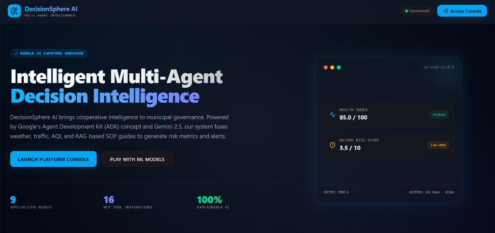
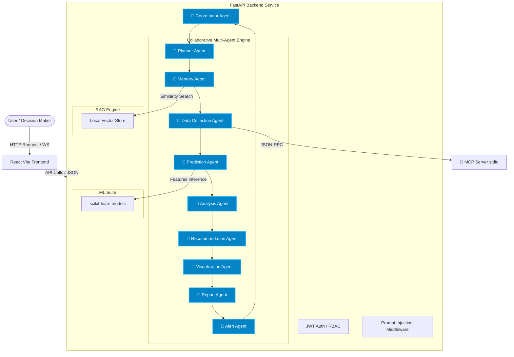

# DecisionSphere AI - Multi-Agent Decision Intelligence Platform

[](https://opensource.org/licenses/MIT)
[](https://www.python.org/)
[](https://fastapi.tiangolo.com/)
[](https://react.dev/)
[](https://vitejs.dev/)



DecisionSphere AI is an enterprise-grade, portfolio-ready decision support platform designed to help municipal authorities, citizens, emergency response teams, and NGOs coordinate and make data-driven safety decisions. The platform leverages a collaborative Multi-Agent graph workflow (using Gemini 2.5), 7 machine learning models, and an integrated Model Context Protocol (MCP) server.

---

## 🏗 System Architecture

The platform follows a modular, decoupled architecture connecting a responsive React frontend, a FastAPI backend service, a pure-Python Vector RAG engine, and a 16-tool Model Context Protocol (MCP) server.



---

## 🤖 Multi-Agent Workflows & Skills

DecisionSphere AI implements a sequential collaborative pipeline aligned with Google's Agent Development Kit (ADK) concepts. Instead of a single chatbot, the work is deconstructed across 9 specialized agent personas:

1. **Coordinator Agent**: Receives user intent, routes tasks, and synthesizes the final executive brief.
2. **Planner Agent**: Deconstructs complex queries into subtasks, optimizing execution sequences.
3. **Memory Agent**: Retrieves matching safety regulations and SOP manuals from the RAG store.
4. **Data Collection Agent**: Aggregates current telemetry parameters (weather, traffic, air quality index).
5. **Prediction Agent**: Executes 7 trained scikit-learn models and crafts explanations using Gemini.
6. **Analysis Agent**: Calculates health indexes, hazard risks, and flags anomalies.
7. **Recommendation Agent**: Formulates clear guidance for citizens, governments, and responders.
8. **Visualization Agent**: Assembles coordinates, heatmaps, and chart timeline coordinates.
9. **Report Agent**: Creates downloadable CSV and text briefs on disk.
10. **Alert Agent**: Monitors thresholds to dispatch active danger alerts.

---

## 🔌 Model Context Protocol (MCP) Integrations

The platform features an embedded MCP server containing 16 specialized decision-making tools:
* **Environmental**: `get_weather`, `get_air_quality`
* **Infrastructure**: `get_traffic`, `get_coordinates`
* **Response Directory**: `find_hospitals`, `find_police_stations`, `get_emergency_contacts`
* **Context**: `search_safety_news`, `get_gov_data`, `get_disaster_history`
* **Parsers**: `read_pdf`, `read_csv`, `read_excel`
* **Utility**: `run_sql_query`, `search_vector_store`, `search_files`

---

## 📂 Project Structure

```
decisionsphere-ai/
├── backend/
│   ├── app/
│   │   ├── agents/      # Coordinator, Planner, Analyst, Alerter, etc.
│   │   ├── mcp/         # MCP standard server and tools
│   │   ├── ml/          # scikit-learn training and inference
│   │   ├── rag/         # Local vector store
│   │   ├── main.py      # FastAPI application entry
│   │   ├── db.py        # SQLite / Postgres SQLAlchemy session
│   │   └── security.py  # Prompt injection and XSS sanitation
│   └── tests/           # Unit, Agent, and Security tests
├── frontend/
│   ├── src/
│   │   ├── App.tsx      # Main layout & pages
│   │   └── index.css    # Tailwind & Glassmorphism styles
│   └── tailwind.config.js
└── docker-compose.yml
```

---

## 🚀 Installation & Local Running

### Prerequisites
* Python 3.11 or later
* Node.js v20 or later
* Gemini API Key (optional, falls back to a sandbox mockup mode if not set)

### Backend Setup
1. Open a terminal in the `backend/` directory.
2. Initialize virtual environment and install packages:
   ```bash
   python -m venv venv
   .\venv\Scripts\activate
   pip install -r requirements.txt
   ```
3. Run the FastAPI server:
   ```bash
   python -m app.main
   ```
   The backend will auto-generate synthetic data, train all 7 ML models (flood, traffic, AQI, disease, crime, water, energy), write the weights, and start on `http://localhost:8000`.

### Frontend Setup
1. Open a terminal in the `frontend/` directory.
2. Install npm packages:
   ```bash
   npm install
   ```
3. Launch the Vite development server:
   ```bash
   npm run dev
   ```
   Open `http://localhost:5173` in your browser.

---

## 🔒 Security Implementations

* **Prompt Injection Detection**: Regular expression heuristics block overrides (e.g. "ignore previous instructions").
* **Role-Based Access Control (RBAC)**: Distinct permissions for `admin`, `government`, `ngo`, and `citizen` roles.
* **Rate Limiting**: Sliding window request limiter protecting backend systems from API exhaustion.
* **Security Logs**: Audit logging tracks unauthorized queries and malicious injection attempts.

---

## 🧪 Testing Suite

Run backend test pipelines utilizing `pytest`:
```bash
cd backend
pytest tests/
```
The suite evaluates REST endpoint schemas, agent state mutation loops, sanitization filters, and MCP tool functions.

---

This is a capstone project for **Kaggle AI Agents: Intensive Vibe Coding Capstone Project**, developed as part of the **5-Day AI Agents Intensive Course with Google**.
